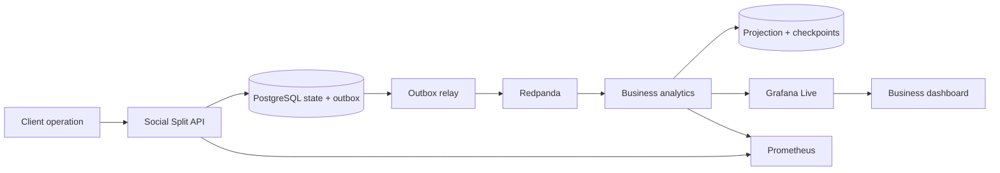

# BankPulse Reference — Reliable Social Split observability

This repository is the complete engineering reference for BankPulse's Social Split flow. It turns a shared-expense operation into durable domain facts, a recoverable business projection and live Grafana indicators, then proves that the release process catches a business failure even when every service remains healthy.

It complements the team-owned [BankPulse repository](https://github.com/VillaforTech/bankpulse). The code provides an executable integration target and evidence model; teammates review and adapt it through their own pull requests rather than receiving automatic contribution credit.

> Accounts, amounts, references and authorizations are synthetic. `ACCEPTED` represents a simulated payment workflow, not a real charge or financial settlement.

## What this reference demonstrates

- Transactional Social Split state and outbox records in PostgreSQL.
- Stable event identity, aggregate revision and idempotent replay through Redpanda.
- An owned analytics projection with checkpoints, coverage and freshness state.
- Three business KPIs recalculated by events and timers.
- A native Grafana Live panel that rejects stale revisions and marks frozen data as stale.
- Recovery after broker outage, analytics restart and duplicate delivery.
- A required release gate that distinguishes technical health from business correctness.

## Data flow



The API commits the aggregate and its fact together. The relay publishes only committed facts. Analytics deduplicates by event identity, advances checkpoints after persistence and reports incomplete coverage instead of inventing history.

## Run the product

Requirements: Docker Compose v2 and about 8 GB available to Docker. Parallel image builds are limited to reduce memory pressure.

```bash
COMPOSE_BAKE=false COMPOSE_PARALLEL_LIMIT=2 docker compose build
docker compose up -d --wait --wait-timeout 300
docker compose -f observability/compose.yaml up -d prometheus grafana
bash scripts/readiness.sh
```

| Surface | Local URL |
| --- | --- |
| Product console and APIs | <http://localhost:18080> |
| Live business dashboard | <http://localhost:13000/d/bankpulse-business> |
| Prometheus | <http://localhost:19090> |
| cAdvisor, optional | <http://localhost:18088> |
| Business snapshot | <http://localhost:18080/api/business/snapshot> |

Grafana's anonymous viewer is bound to loopback for this development environment. Databases are not published to the host. Do not expose the stack to the Internet or reuse its demo credentials.

Stop the stack while preserving volumes and recovery history:

```bash
docker compose -f observability/compose.yaml down
docker compose down
```

## Try Social Split

The product accepts a USD 100 group expense split as 33.34 + 33.33 + 33.33. Each authorized share receives a demo payment reference; closing is allowed only when every participant consents and the exact total matches.

```bash
bash scripts/smoke-v2.sh
bash scripts/business-test.sh
```

The business test also verifies that 60+30, 60+50, missing consent and an empty session cannot close. It stores the observed facts in `artifacts/business/result.json` and fails independently of infrastructure health.

## Validate the full system

```bash
bash scripts/unit-test.sh
bash scripts/projection-test.sh
python3 scripts/resilience_test.py
npm ci
npx playwright install --with-deps chromium
npm run browser-test
```

The browser test performs at least 100 identifiable operations and waits until the same event and revision appear on the Grafana panel for two animation frames. It records losses, errors and latency from the browser's own clock; p95 above one second fails. The resilience test covers broker interruption, pending outbox delivery, analytics restart, duplicate replay and a real 120-second no-traffic deadline.

The final branch passed:

- all required GitHub checks and `Release gate`;
- 100/100 correlated Grafana renders with no loss or browser errors;
- 29 business checks, 9 projection checks and 8 recovery checks;
- a clean local devcontainer reproduction;
- a fresh 4-core Codespace reproduction with p95 358 ms.

See the [versioned Codespaces evidence](docs/evidence/codespaces-20260915/README.md), [business event contract](docs/business-events.md), [KPI definitions](docs/business-kpis.md) and [observability guide](observability/README.md).

## Failure story

The reference preserves a deliberately broken revision where six services report healthy while invalid splits close. The business oracle fails and the required gate blocks the pull request at that exact SHA. The corrected revision restores the invariant and passes the same pipeline. This red-to-green history is retained as engineering evidence rather than described as an expected result.

## Relationship to the team project

| Shared workstream | Reference implementation |
| --- | --- |
| Domain and events | `services/social-split-api`, event contracts and transactional tests |
| Analytics | `services/business-analytics`, projection and replay tests |
| Live experience | Grafana plugin, dashboard and browser harness |
| Platform integration | Isolated Compose stack, readiness and required CI gate |
| Verification | Business, resilience, browser and evidence scripts |

This reference was implemented by Roberto Villafuerte with Codex assistance. It preserves the original repository history but does not imply that other team members authored its changes. Their portfolio credit belongs to work reviewed and integrated in the shared repository.


## Verification evidence

See [business verification and recovery](docs/business-verification.md) for failure scenarios, diagnosis, release controls and reproducible results.
