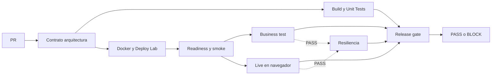

# Deber 01: El Falso Verde en BankPulse

Roberto Villafuerte · CMP4008 · Referencia independiente · 14 de septiembre de 2026.

## 1. Capacidad seleccionada

Cerrar un compromiso Social Split solo si todas sus cuotas positivas suman el total y cada participante autorizó con una referencia no vacía. Se guarda `closedAt` una sola vez y se impiden modificaciones posteriores.

## 2. Falso verde

La base permitía cerrar USD 100 con 60 + 30 autorizados: comprobaba consentimiento, pero no suma. La API podía responder 200, PostgreSQL y JVM seguir UP y el estado quedar COMPLETED con un hueco de 10. La mutación de demostración elimina únicamente la comparación marcada `MUTATION_TARGET_SUM`; el test y el consumidor no cambian.

## 3. Riesgo o pérdida potencial

Un compromiso se presenta como resuelto aunque falte parte de su cobertura. Esto puede provocar conciliación incorrecta, decisiones equivocadas o reclamos. Los 10 son un descuadre demo; no acreditan dinero cobrado, liquidado ni una pérdida financiera real.

## 4. Pipeline

Unit tests y laboratorio son independientes: un unit rojo no impide recoger salud UP y negocio incorrecto en el mismo SHA. Ambos resultados son obligatorios en el gate. Fallo, cancelación o etapa omitida bloquean. El navegador también se ejecuta cuando negocio falla; resiliencia exige negocio y navegador correctos. Los artifacts se conservan antes de parar servicios.

## 5. PR correcto y CI verde inicial

[PR #1](https://github.com/VillaforTech/BANKPULSE-V2.1-LAB2-REFERENCE/pull/1), SHA `3fcfa686dcedf5b41ec6f0cf152ddcb7f21fccb0`: [run 34886628779](https://github.com/VillaforTech/BANKPULSE-V2.1-LAB2-REFERENCE/actions/runs/34886628779) terminó con arquitectura, unitarias, laboratorio y Release gate en success. Smoke conserva `cmp`; negocio pasa 29/29, Java 10/10 (incluye dos rollback reales del outbox), panel 7/7, analítica/proyección 9/9 y resiliencia 8/8.

El navegador Ubuntu observó 100/100 eventos, sin pérdida ni error de muestra/página; p95 945,4 ms, máximo 1.931,9 ms y cuatro muestras ≥1 s. El criterio exige p95 ≤1 s. Ambos campos visibles conservan evento, revisión, calidad y valor esperados; B-K1 permanece en 100 durante esta carga. El timer de 120 s se observó 0,508 s después del límite en un snapshot ya persistido. [JSON, capturas y límites de esta medición](evidence/ci-green-34886628779/README.md).

## 6. PR con tecnología verde y negocio rojo

[PR #2](https://github.com/VillaforTech/BANKPULSE-V2.1-LAB2-REFERENCE/pull/2), SHA rojo `90745a4a58a84078b8557c0616dd8df5764ba2a6`: [run 34888923085](https://github.com/VillaforTech/BANKPULSE-V2.1-LAB2-REFERENCE/actions/runs/34888923085). Nace del SHA sano `3fcfa68`; PR #1 todavía no estaba integrado, por lo que el diff contra main incluía la implementación previa. Contra la base sana, la mutación cambia una sola línea a `if (false && sum.compareTo(totalAmount) != 0)`. No cambia pruebas ni consumidor.

El business test registró cuatro fallos y JUnit dos: el agregado under `3aecd371-d131-4853-9570-e37bc11c9781` respondió 200 y persistió COMPLETED con total 100 y cuotas 60 + 30; over `7caf8ae1-9532-4950-b76b-bbeff445b540` hizo lo mismo con 60 + 50. Cada cohorte individual mostró B-K1 = 0% y B-K2 = 10,00. La consulta posterior, en el mismo SHA, confirmó los estados y seis servicios HTTP 200 / UP a las 19:52:31–32 UTC.

La captura real de Grafana mostró VIGENTE · ALERTA, cobertura completa, integridad global 50% y descuadre 20: combina dos cierres válidos y dos inválidos. El navegador siguió entregando esos valores y pasó sus 100 muestras; eso no vuelve correcto al negocio. [Evidencia roja sin modificar](evidence/demo-red-34888923085/README.md).

## 7. Evidencia del bloqueo

La captura independiente de GitHub a las 20:10:30 UTC observó PR #2 ready, OPEN y `mergeStateStatus = BLOCKED`, con el mismo SHA que el run rojo. La protección del gemelo exigía `Release gate` con strict y ese check estaba en failure. [Resumen de la observación](evidence/demo-red-34888923085/github-summary.json), [PR](evidence/demo-red-34888923085/github-pr.json), [protección](evidence/demo-red-34888923085/github-protection.json) y [resultado del gate](evidence/demo-red-34888923085/release-gate.json). El bloqueo no se deduce solo de JUnit; las protecciones del original permanecen aparte.

## 8. Diagnóstico y corrección

La demostración se corrige restaurando `if (sum.compareTo(totalAmount) != 0)` en el mismo PR #2, después de congelar y auditar el rojo. No se rebajan assertions, muestras ni el umbral de 1 s.

Social Split: invariante incompleta, ausencia de estado final inmutable y fecha de cierre. Corrección: regla de suma exacta con BigDecimal, autorizaciones/referencias, cuotas positivas, cierre repetible, validación de dinero, bloqueo transaccional y un outbox que se confirma junto con el estado; la publicación ocurre después del commit. El frontend reparte centavos y el resto para evitar que 100 / 3 termine en 99,99.

Payments: el fallo histórico era diferencia del JSON inicial y reintento. La implementación original creaba `Instant.now()` en memoria mientras MariaDB almacenaba menor precisión. La reproducción del commit base `dab7151` confirmó el mismo ID: `createdAt` pasó de `2026-09-14T18:47:05.292308678Z` en la respuesta inicial a `.292308Z` en el reintento. [Ambos JSON y diagnóstico](evidence/baseline/diagnostic.json); no se presenta diferencia textual como pago duplicado. Se normaliza precisión de tiempo y dinero, se rechaza reutilización de clave con otro payload y se valida concurrencia. `cmp` se conserva; el oráculo además comprueba un pago persistido y un evento Audit correlacionado.

## 9. Verificación posterior de la corrección y reproducción

La corrección continúa en el [mismo PR #2](https://github.com/VillaforTech/BANKPULSE-V2.1-LAB2-REFERENCE/pull/2). Su cuerpo y checks identifican el SHA y el run posterior exactos una vez terminada la ejecución; este documento no anticipa un PASS. La integración requiere todos los checks verdes y se limita al código sano. La evidencia verde inicial y roja queda versionada; el artifact de la corrección se conserva además localmente.

[Guía reproducible de Codespaces](CODESPACES.md): scripts reales de setup/start, observabilidad, puertos 18080/13000/19090, pruebas y parada. La [ejecución en Codespaces limpio](evidence/codespaces-20260915/README.md) pasó el 15 de septiembre en `7097e44040a4`: smoke, unitarias/persistencia, 29 controles de negocio, 100/100 renders con p95 358 ms y 8 controles de recuperación. Se guardó la evidencia y se retiró el entorno temporal; no se atribuye reproducción a otro integrante. El envío del deber y su recibo quedan separados de preparar o publicar esta referencia.

## Extras y evidencia

Contratos: [eventos](events-deber-01.md) y [KPIs](kpis-deber-01.md). Herramientas: `scripts/projection-test.sh`, `scripts/resilience_test.py` y `scripts/browser-test.mjs`. Raw JSON/capturas se guardan bajo artifacts y se publican como artifacts de CI; las selecciones sanas y rojas están versionadas en `docs/evidence/` con hashes SHA-256 y revisión independiente.

La primera medida exploratoria 100/100 observó revisiones sin pérdidas, p95 ≈ 233 ms, pero permitía estado INCOMPLETO transitorio; por eso no acredita la aceptación visual estricta. El harness final exige el contador y B-K1 visibles, formato exacto, misma revisión/evento y calidad VIGENTE; vuelve a comprobarlos al terminar los dos frames de render. El [resultado estricto local](evidence/local-2026-09-14/README.md) observó 100/100 eventos, cero pérdidas/errores, p95 de 915,5 ms y máximo de 1.116,3 ms. Conserva todas las muestras y capturas. El máximo se muestra aunque el criterio evalúa p95.

Resiliencia local: ocho comprobaciones pasaron, incluida recuperación sin eventos nuevos y vencimiento de 120 s leído del historial ya persistido. El rechazo de escritura del outbox también revierte el estado del agregado.

No se borra historia para recuperar verde. Los fixtures negativos que permanecen OPEN generan alertas B-K3 después de 120 s; un cierre inválido histórico permanece en B-K1/B-K2 hasta abandonar su cohorte. El benchmark se ejecuta sin otra carga concurrente y registra navegador, conteos y reloj.

## Contribuciones y procedencia

Implementación de referencia: Roberto Villafuerte con asistencia de Codex. La distribución de los issues originales organiza trabajo del equipo, pero no acredita aportes de compañeros aquí. El historial inicial y ADR se conservan. Los tests/documentación de cada PR explican su revisión concreta.
