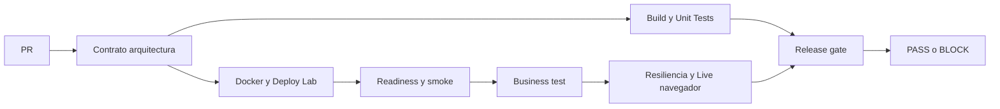

# Deber 01: El Falso Verde en BankPulse

Roberto Villafuerte · CMP4008 · Referencia independiente · 14 de septiembre de 2026.

## 1. Capacidad seleccionada

Cerrar un compromiso Social Split solo si todas sus cuotas positivas suman el total y cada participante autorizó con una referencia no vacía. Se guarda `closedAt` una sola vez y se impiden modificaciones posteriores.

## 2. Falso verde

La base permitía cerrar USD 100 con 60 + 30 autorizados: comprobaba consentimiento, pero no suma. La API podía responder 200, PostgreSQL y JVM seguir UP y el estado quedar COMPLETED con un hueco de 10. La mutación de demostración elimina únicamente la comparación marcada `MUTATION_TARGET_SUM`; el test y el consumidor no cambian.

## 3. Riesgo o pérdida potencial

Un compromiso se presenta como resuelto aunque falte parte de su cobertura. Esto puede provocar conciliación incorrecta, decisiones equivocadas o reclamos. Los 10 son un descuadre demo; no acreditan dinero cobrado, liquidado ni una pérdida financiera real.

## 4. Pipeline

Unit tests y laboratorio son independientes: un unit rojo no impide recoger salud UP y negocio incorrecto en el mismo SHA. Ambos resultados son obligatorios en el gate. Fallo, cancelación o etapa omitida bloquean. Los artifacts se conservan antes de parar servicios.

## 5. PR correcto y pruebas locales

Resultados locales iniciales: smoke-v2 pasó conservando `cmp`; business test pasó 29 comprobaciones; diez tests Java (incluidos dos rollback transaccionales), cuatro de KPIs y siete del panel pasaron. Son resultados de desarrollo, no prueba de CI ni aceptación de todo el alcance. El run y PR finales del gemelo se incorporan tras observar sus resultados reales.

## 6. PR con tecnología verde y negocio rojo

Pendiente de enlazar la demostración remota observada. La regresión queda en una rama/PR de demostración y nunca se fusiona en main. Su business test debe detectar el agregado incorrecto por API y la proyección debe mostrar B-K1 = 0 y B-K2 = 10 en la cohorte inválida. Los JSON guardan salud, fixture y persistencia; no se sustituye el caso por un `exit 1` arbitrario.

## 7. Evidencia del bloqueo

El gemelo requiere el check exacto `Release gate`. Se documentará el estado efectivo del PR y la protección del gemelo, no se inferirá bloqueo de merge solo a partir de un test rojo. Las protecciones del original permanecen aparte.

## 8. Diagnóstico y corrección

Social Split: invariante incompleta, ausencia de estado final inmutable y fecha de cierre. Corrección: regla de suma exacta con BigDecimal, autorizaciones/referencias, cuotas positivas, cierre repetible, validación de dinero, bloqueo transaccional y un outbox que se confirma junto con el estado; la publicación ocurre después del commit. El frontend reparte centavos y el resto para evitar que 100 / 3 termine en 99,99.

Payments: el fallo histórico era diferencia del JSON inicial y reintento. La implementación original creaba `Instant.now()` en memoria mientras MariaDB almacenaba menor precisión. La reproducción del commit base `dab7151` confirmó el mismo ID: `createdAt` pasó de `2026-09-14T18:47:05.292308678Z` en la respuesta inicial a `.292308Z` en el reintento. [Ambos JSON y diagnóstico](evidence/baseline/diagnostic.json); no se presenta diferencia textual como pago duplicado. Se normaliza precisión de tiempo y dinero, se rechaza reutilización de clave con otro payload y se valida concurrencia. `cmp` se conserva; el oráculo además comprueba un pago persistido y un evento Audit correlacionado.

## 9. Ejecución final verde y reproducción

Pendiente de registrar el run final y la revisión exacta verificados. No confundir estos pendientes de evidencia remota con un PASS anticipado. [Comandos de reproducción](CODESPACES_REFERENCE.md). El envío del deber y su recibo quedan separados de preparar o publicar esta referencia.

## Extras y evidencia

Contratos: [eventos](events-deber-01.md) y [KPIs](kpis-deber-01.md). Herramientas: `scripts/projection-test.sh`, `scripts/resilience_test.py` y `scripts/browser-test.mjs`. Raw JSON/capturas se guardan bajo artifacts y se publican como artifacts de CI; una copia seleccionada puede adjuntarse a `docs/evidence/`.

La primera medida exploratoria 100/100 observó revisiones sin pérdidas, p95 ≈ 233 ms, pero permitía estado INCOMPLETO transitorio; por eso no acredita la aceptación visual estricta. El harness final exige el contador y B-K1 visibles, formato exacto, misma revisión/evento y calidad VIGENTE; vuelve a comprobarlos al terminar los dos frames de render. El [resultado estricto local](evidence/local-2026-09-14/README.md) observó 100/100 eventos, cero pérdidas/errores, p95 de 915,5 ms y máximo de 1.116,3 ms. Conserva todas las muestras y capturas. El máximo se muestra aunque el criterio evalúa p95.

Resiliencia local: ocho comprobaciones pasaron, incluida recuperación sin eventos nuevos y vencimiento de 120 s leído del historial ya persistido. El rechazo de escritura del outbox también revierte el estado del agregado.

No se borra historia para recuperar verde. Los fixtures negativos que permanecen OPEN generan alertas B-K3 después de 120 s; un cierre inválido histórico permanece en B-K1/B-K2 hasta abandonar su cohorte. El benchmark se ejecuta sin otra carga concurrente y registra navegador, conteos y reloj.

## Contribuciones y procedencia

Implementación de referencia: Roberto Villafuerte con asistencia de Codex. La distribución de los issues originales organiza trabajo del equipo, pero no acredita aportes de compañeros aquí. El historial inicial y ADR se conservan. Los tests/documentación de cada PR explican su revisión concreta.
